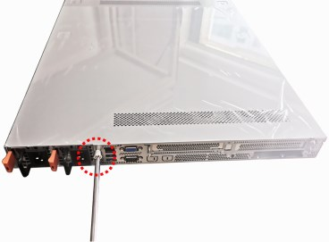

 This is exclusively created for practicing Git workflow.

<Indent>
 - This content is indented with a vertical guide line

            - It's useful for showing hierarchical relationships
</Indent>

1. Select tenant.
   