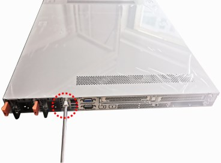

This page contains internal-only content that should not be visible to the public.

## Internal Only Titles or Labels

<div className="my-custom-color">
**Internal Use Only**

**DDN Internal Use Only**
</div>

## Internal Only Text

This is <span className="my-custom-color">colored text</span> in a paragraph.

## Internal Only Paragraph

<div className="my-custom-color">
This entire paragraph has custom styling with colored text. Lorem ipsum dolor sit amet, consectetur adipiscing elit. Nulla facilisi. Nullam euismod, nisl eget ultrices ultrices, nunc nisl ultrices nunc, euismod ultrices nisl nisl euismod.
</div>

## Internal Only Table

<div className="my-custom-color">

<table>
| Plant | Light Requirements | Water |
|-------|-------------------|-------|
| Fern | Partial shade | Weekly |
| Snake Plant | Low to bright indirect | Bi-weekly |
| Monstera | Bright indirect | Weekly |
| Pothos | Low to bright indirect | Weekly |
| Fiddle Leaf Fig | Bright indirect | Weekly |
| Peace Lily | Low to medium indirect | Weekly |
| Rubber Plant | Bright indirect | Weekly |
| ZZ Plant | Low to bright indirect | Bi-weekly |
| Philodendron | Medium to bright indirect | Weekly |
| Aloe Vera | Bright direct | Bi-weekly |
| Boston Fern | Partial shade | 2-3x weekly |
| Spider Plant | Medium to bright indirect | Weekly |
| Dracaena | Medium indirect | Weekly |
| Bird of Paradise | Bright indirect to direct | Weekly |
| Calathea | Medium indirect | Weekly |
</table>
</div>

## Internal Only Code Block Example

<div className="my-custom-color">
```bash
redcli tenant show <tenant_name> [flags]
```
</div>

## Internal Only Card Example

<Card title="Example">
<div className="my-custom-color">
   This example shows details for the `SYSTEM_DATA` profile.

   ```none
   $ redcli dataset profile show SYSTEM_DATA
   9:03PM INF Auto Selecting cluster: c1uster-gray
   9:03PM INF Auto Selected config: auto_config

   ┌────┬─────────────┬─────────────┬───────────┬────────────┬───────────┬────────────┬────────────┬──────────────┬───────────┬───────────┐
   │ ID │    NAME     │ Metapool ID │ Meta LTID │ Datapool ID│ Data LTID │ Efficiency │ Protection │ Availability │ MinStripe │ MaxStripe │
   ├────┼─────────────┼─────────────┼───────────┼────────────┼───────────┼────────────┼────────────┼──────────────┼───────────┼───────────┤
   │  1 │ SYSTEM_DATA │      1      │     2     │      1     │     3     │     87     │     11     │       8      │   32768   │   262144  │
   └────┴─────────────┴─────────────┴───────────┴────────────┴───────────┴────────────┴────────────┴──────────────┴───────────┴───────────┘
   ```
</div>
</Card>

## Internal Only Callout Example

<Note>
<div className="my-custom-color">
For deployment of DDN Infinia on GCP, currently the maximum supported length for the instance name is 54 characters.
</div>
</Note>

## Internal Only Image Example

<div className="my-custom-color">
<Frame caption="Tyan captivescrew">

</Frame>
</div>