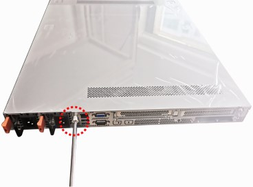

This page contains internal-only content that should not be visible to the public.

## Internal Only Titles or Labels

**<span className="internal-text">Internal Use Only</span>**

**<span className="internal-text">DDN Internal Use Only</span>**

## Internal Only Text

This is <span className="internal-text">colored text</span> in a paragraph.

## Internal Only Paragraph


<div className="internal-block">
This entire paragraph has custom styling with colored text. This example shows details for the `SYSTEM_DATA` profile.
</div>

## Internal Only Table

<div className="internal-block">
| Plant | Light Requirements | Water |
|-------|-------------------|-------|
| Fern | Partial shade | Weekly |
| Snake Plant | Low to bright indirect | Bi-weekly |
| Monstera | Bright indirect | Weekly |
| Pothos | Low to bright indirect | Weekly |
| Fiddle Leaf Fig | Bright indirect | Weekly |
| Peace Lily | Low to medium indirect | Weekly |
| Rubber Plant | Bright indirect | Weekly |
| ZZ Plant | Low to bright indirect | Bi-weekly |
| Philodendron | Medium to bright indirect | Weekly |
| Aloe Vera | Bright direct | Bi-weekly |
| Boston Fern | Partial shade | 2-3x weekly |
| Spider Plant | Medium to bright indirect | Weekly |
| Dracaena | Medium indirect | Weekly |
| Bird of Paradise | Bright indirect to direct | Weekly |
| Calathea | Medium indirect | Weekly |
</div>

## Internal Only Code Block Example

<div className="internal-block">
```bash
redcli tenant show <tenant_name> [flags]
```
</div>

## Internal Only Card Example

<div className="internal-block">
<Card title="Example">
   This example shows details for the `SYSTEM_DATA` profile.
   
   ```none maxLines=0
   $ redcli dataset profile show SYSTEM_DATA
   9:03PM INF Auto Selecting cluster: c1uster-gray
   9:03PM INF Auto Selected config: auto_config

   ┌────┬─────────────┬─────────────┬───────────┬────────────┬───────────┬────────────┬────────────┬──────────────┬───────────┬───────────┐
   │ ID │    NAME     │ Metapool ID │ Meta LTID │ Datapool ID│ Data LTID │ Efficiency │ Protection │ Availability │ MinStripe │ MaxStripe │
   ├────┼─────────────┼─────────────┼───────────┼────────────┼───────────┼────────────┼────────────┼──────────────┼───────────┼───────────┤
   │  1 │ SYSTEM_DATA │      1      │     2     │      1     │     3     │     87     │     11     │       8      │   32768   │   262144  │
   └────┴─────────────┴─────────────┴───────────┴────────────┴───────────┴────────────┴────────────┴──────────────┴───────────┴───────────┘
   ```
</Card>
</div>

## Internal Only Callout Example

<div className="internal-block">
<Note>
For deployment of DDN Infinia on GCP, currently the maximum supported length for the instance name is 54 characters.
</Note>
</div>

<div className="internal-block">
<Warning>
For deployment of DDN Infinia on GCP, currently the maximum supported length for the instance name is 54 characters.
</Warning>
</div>


<div className="internal-block">
<Info>
For deployment of DDN Infinia on GCP, currently the maximum supported length for the instance name is 54 characters.
</Info>
</div>

<div className="internal-block">
<Error>
For deployment of DDN Infinia on GCP, currently the maximum supported length for the instance name is 54 characters.
</Error>
</div>

## Internal Only Image Example

<div className="internal-block">
<Frame caption="Tyan captivescrew">

</Frame>
</div>

## Internal Only Table for Specific Cells

<table>
| Plant | Light Requirements | Water |
|-------|-------------------|-------|
| <span className="internal-text"> Fern </span> | <span className="internal-text"> Partial shade </span> | <span className="internal-text"> Weekly </span> |
| Snake Plant | Low to bright indirect | Bi-weekly |
| Monstera | Bright indirect | Weekly |
| Pothos | Low to bright indirect | Weekly |
| Fiddle Leaf Fig | Bright indirect | Weekly |
| Peace Lily | Low to medium indirect | Weekly |
| Rubber Plant | Bright indirect | Weekly |
| ZZ Plant | Low to bright indirect | Bi-weekly |
| Philodendron | Medium to bright indirect | Weekly |
| Aloe Vera | Bright direct | Bi-weekly |
| Boston Fern | Partial shade | 2-3x weekly |
| Spider Plant | Medium to bright indirect | Weekly |
| Dracaena | Medium indirect | Weekly |
| Bird of Paradise | Bright indirect to direct | Weekly |
| Calathea | Medium indirect | Weekly |
</table>
